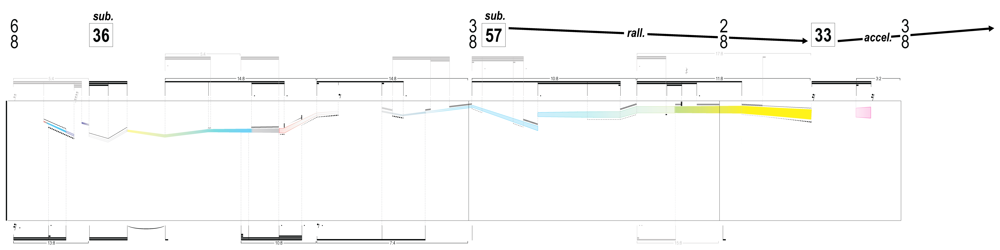
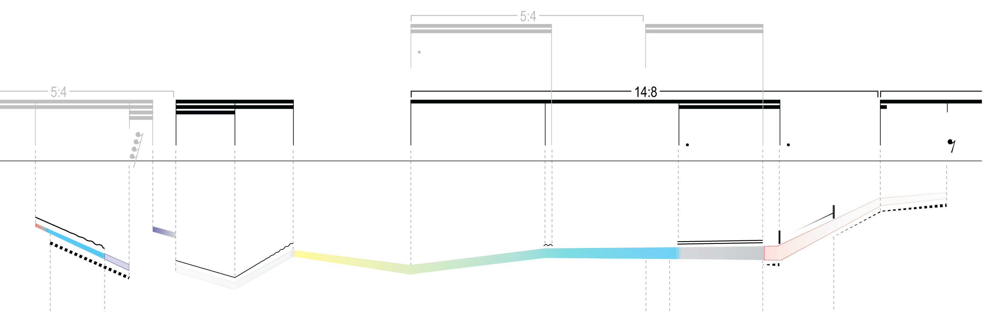
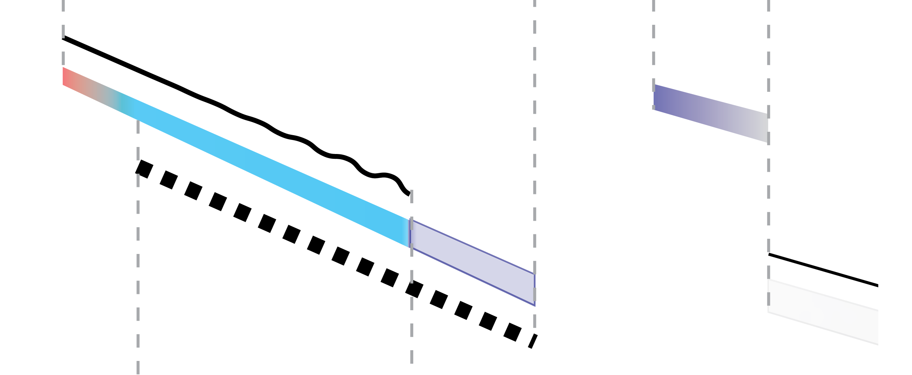

build-lists: true

# [fit]Artistic Research Residency IRCAM
## 31 May 2016
### James Bean

---

# Thanks!
^
- IRCAM
- Harvard
- Musical Representations Team
- ISMM for allowing me to work in their office until 4am as I succumb to jetlag
- Emmanuel Jourdan
- Paola Palumbo
- Stéphanie Leroy + tout le monde administrative 
- Fleur Delepière + traduction !
and others ...

---

# Background

## As composer

- University of California, San Diego (UCSD), 2013 ... 2015

	- Rand Steiger

- Harvard University, 2015 ... ?

	- Chaya Czernowin
	- Hans Tutschku

---

## Audio engineer, performer of electronic music

---

---

# [fit]THIS WILL BE CHANGED AND MADE SOLID
## cycle for 8 amplified performers
### 2011-2012

^ 
- Began working on pieces for a cycle in 2011
	- Ultimately performed in its entirety as my final composition recital for my bachelor's degree
	- For which I served as
		- conductor
		- audio engineer
		- videographer
- Didn't start as a cycle, but congealed into one
- Depending on how you cut it up, there are 4 or 7 (or technically, many more) pieces comprising this cycle

---

# [fit]_this will be changed and made solid II_
## for string quartet

^ 
- The second one is a piece for string quartet

---

JACK Quartet – 2012

(excerpt)

^
Begin audio

---

^ 
Make sure audio is playing ...

---

---

---

---

---

---

---

---

---

---

---

# [fit]_this will be changed and made solid II_

- Different conception of material
- Requires different nature of notational intermediation

^
- For these pieces, different notational strategies were needed to communicate the musical "materials" that I was interested in performatively and sonically
- For the most part, I was not as interested in the manipulation of musical materials, as is generally understood
- But rather, a flow of sub-material currents in a state of continuous change
- Within which the performers of the ensemble act 
- How to notate ...

---

^ 
- Here is a violin part.
- Many playing techniques that are traditionally represented with black-ink symbols or verbal descriptions, are instead merged into a single multidimensional graphical objects
- When considering the physicality of these actions, it is possible to morph seamlessly between them

---

### Mapping of graphical space and color space to physical space

Example: right-hand:

- Line width: bow pressure
- Color: bow contact point 
	- _molto sul ponticello_ ... _molto sul tasto_
- Vertical position: bow position

---

---

---

---

# [fit]_this will be changed and made solid I**a**_
## for solo voice

^ 
- The first piece that was actually written for the cycle is a piece for solo voice
- Similar graphical and musical approaches to the string quartet
- In some ways, more adventurous
- Probably ultimately the least successful
	- Notationally, but also compositionally
	- though I'm not sure ...

---

^ 
- Here, instead of bow and finger movement
- Graphical properties (including a 2-dimensional color space)
- Mapped to the physical movement of the mouth, its shape, the tongue, and so forth

---

---

^
- And in this case, the back and front of the tongue operate polyphonically

---

^
A companion work to the voice piece if a solo alto saxophone piece.

---

# [fit]_this will be changed and made solid I**b**_
## for alto solo saxophone

--- 

^ 
Again, the tongue, airflow, register, and fingers are mapped to notational elements

---

---

---

# [fit]Issues of portability with these strategies for notation

- Colors print unreliably
	- Different colors print with varying success
	- Very noticeable in small objects due to "misregistration"

- Gray values print unreliably
	- Particularly in very small contexts
	- Very noticeable due to "half-toning"

^
- Misregistration: multiple passes for each color a printer makes is inherently imperfect, and there for you get a smear of multiple colors on the edge of graphical objects.
- Particularly bad for small objects, which is essentially all musical objects
- Half-toning: dots of black for grayscale

---

# [fit]Issues of portability with these strategies for notation

- For my purposes, printing was unreliable.

- Particularly problematic when colors and gray values are mapped directly to musical information.

- Thus, if the printing differs, the musical material is actually changed.

^
As we saw in the notational examples thus far, this direct mapping _is_ the music.

---

---

# [fit]Issues with process of implementing these strategies

- The scores took too long to make (300–600hr)

- Each of the scores authored with a combination of
	- MakeMusic _Finale_
	- Adobe _Illustrator_
	- Each having incompatible ideologies for displaying information

---

# [fit]Issues with process of implementing these strategies

- A very wide feedback loop of compositional creation to symbolic representation and aesthetic verification is created

- Making it practically impossible to modify a score

- Impacting compositional decisions and process

---

# [fit]Issues with process of implementing these strategies

- To make this all more frustrating, the score authoring process was all quite systematic.

^
- How to systematize this properly?
- How can I make this less fraught with certain obstacles?

---

---

# Going forward

- At the same time, my compositional desires were shifting.
- I was becoming interested in merging the graphical / tablature notations with the traditional, staff notation, as best suited for a given material
- It became clear that certain types of musical material was better notated in the graphical style, other material traditionally
- I wanted to be able to convert between these two modes

---

# First steps

- Upon investigating the tools most immediately available, I began a knowingly temporary, though edifying implementation of a few of these concepts.
- Using ExtendScript (ECMAScript dialect for Adobe) to script into Illustrator
- Get a hold of the patterns of managing semantically-rich graphical data
- Built-in GUI to correct the algorithmically generated results intuitively

---

# Proof of Concept: _deserving of Songs_
## [fit]for two flutes and two contrabasses

^ 
- Looking to enrich the purely graphical notational strategies of _THIS WILL BE CHANGED AND MADE SOLID_

---

^
There were two primary goals (in addition to passing the Composition Jury process)
- Primitive string tablature information <-> staff information
- Woodwind fingering information <-> staff information

---

^
- Tablature graph (middle) with sounding pitches above, and fingered pitches below
- This accommodates for scordature

---

^
- Close-up of the primitive left hand tablature, with artificial harmonics labeled by their partial number

---

^
- Sequence of multiphonics with their fingerings and sounding pitches

---

^
- Aaaand a close up why not

---

---

# Field Test 1: _dry;run._
## for flute, clarinet, and viola

---

^
- The primary goal for this project (aside from attempting to pass the second Composition Jury)
was to automatically generate a filtered view of the other players' music for a given performer.
- Not so elegant here, but what we are seeing is the clarinet part, 
- Again, the clarinet part carries with it the transposed as well as concert representation of its pitches, for communication with the non-transposing instruments

---

- Still in Illustrator
- Still on paper

^
- Now, this was all still scripted into Illustrator
- With the final output on paper

--- 

^
- As soon as that piece was finished, I immediately started writing a version in Swift (which just came out) for iOS devices.
- Because, all along the biggest issues with the paper score are
	- unreliability
	- lack of user influence of notational environment

---

# dn-m
## dynamic notation for music

---

- In addition to extending semantic support for graphic and tablature notations
- Enable performers to control their notational environment

^
Current paradigm: composers compile their score, and performers are influenced greatly by how that composer chose to 

---

- Currently, performers annotate their scores with a lot of information that is latent in the musical model that is generating the score in the first place

- For example:

	- Beat markings
	- Cues (of various dimensions)

^
- These are things that performers are already doing!

---

^
- This is a screen capture of an early version of a proof-of-concept level implementation of a built-in metronome
- In the case of complex rhythmic material, there is system that provides an optimal way to subdivide, in a local metrical context

---

---

# Score Component Filtering

---

^
- Go to simulator
- Don't mind the awful UI colors

---

# Current work

- Restructure code for increased modularity
	- Now many submodules, as opposed to single massive project

^
- For now, really not glamorous stuff !

---

- Design patterns for coordinating of very high-accuracy triggering and organization of events
- Strategies for timing between multiple wirelessly connected devices
- Refine the domain specific input language
- MusicXML, MIDI parsing

^
- Many other things under the hood to talk about if they are of interest

---

github.com/dn-m ` // repos`
dn-m.github.io ` // docs`

---

---

Questions ?

---

---

Thanks!

---

---